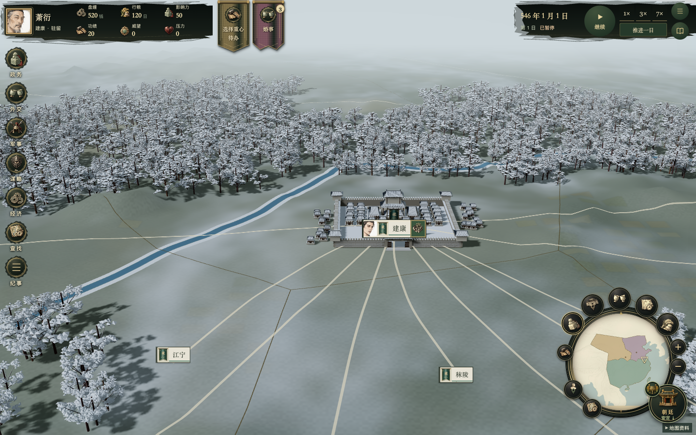
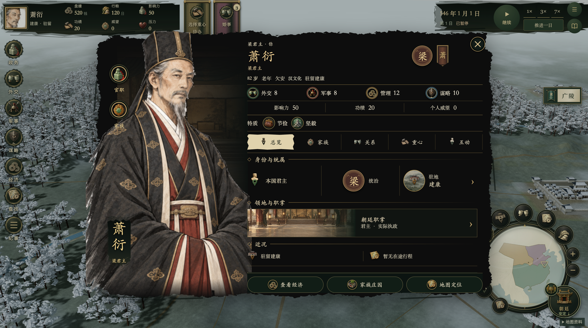
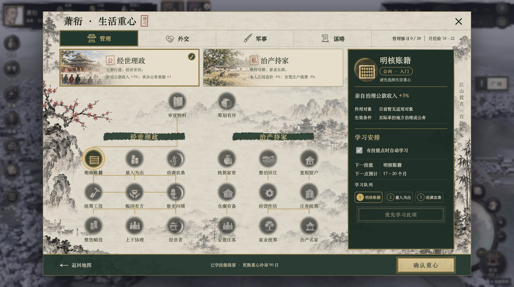
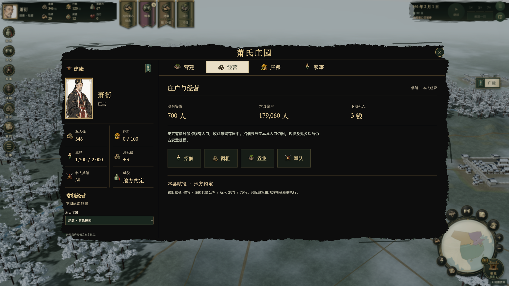

<p align="center">
  
</p>

<h1 align="center">风云南北朝</h1>

<p align="center">
  <strong>一段人物的人生，一场家国的风云。</strong><br>
  南北朝题材 · 人物驱动的历史模拟 RPG · 桌面浏览器单人策略
</p>

<p align="center">
  <a href="https://siegtrack.com/games/fengyun-nanbeichao/"><strong>▶ 在线游玩</strong></a>
  &nbsp; · &nbsp;
  <a href="#游戏玩法">游戏玩法</a>
  &nbsp; · &nbsp;
  <a href="#初入乱世">上手指南</a>
  &nbsp; · &nbsp;
  <a href="docs/更新日志/README.md">更新日志</a>
</p>

---

《风云南北朝》让你以一个人物的身份进入南北朝的世界。在山河之间出行，在朝堂上履职，在庄园中经营家业，也在战争与人情中选择自己的立场。

从士人、官员、将领到宗室与君主，不同身份有不同的职责、资源和行动机会。你可以把精力放在入仕建功、治产持家、交游结亲，或统军与谋略上；能力、关系、官职和家族会随着选择与时间推进而变化。

**[立即进入游戏 →](https://siegtrack.com/games/fengyun-nanbeichao/)**　使用鲤世界账号登录，推荐在桌面浏览器游玩。

## 游戏画面

<table>
  <tr>
    <td width="50%" align="center">
      <a href="docs/images/campaign-map.png"></a><br>
      <strong>山河与城邑</strong><br>沿地图规划行程，在真实驻地开展行动
    </td>
    <td width="50%" align="center">
      <a href="docs/images/character.png"></a><br>
      <strong>人物与身份</strong><br>从一张人物档案进入官职、家族与关系
    </td>
  </tr>
  <tr>
    <td width="50%" align="center">
      <a href="docs/images/lifestyle.png"></a><br>
      <strong>修习与成长</strong><br>选择生活重心，安排技能学习顺序
    </td>
    <td width="50%" align="center">
      <a href="docs/images/estate.png"></a><br>
      <strong>庄园与家业</strong><br>安排营建、庄粮与经营，照料家族事务
    </td>
  </tr>
</table>

*以上为本地迭代版本的实机截图，人物与生活重心摄于 2026-10-10，庄园摄于 2026-10-09；线上版本可能随发布进度有所差异。点击图片可查看原图。*

## 游戏玩法

### 人物人生：选择你想成为什么样的人

人物的管理、外交、军事与谋略能力影响其擅长的行动。生活重心进一步区分公私方向：经世理政或治产持家，奉使交邦或交游结亲，统军经武或修武蓄众，谋国辅政或谋身营势。安排修习与技能学习，把成长用于相应的职责和生活场景。

关系也需要经营。交好、赠礼、延聘、议婚与家族事务会牵动私财、时间和人情；年龄、健康、特质与亲缘影响人物处境。家产与亲属关系为人生延续提供基础。

### 仕宦治世：从一件差事做起

以当前身份申请任职、承办公务或参与朝廷事务。地方官处理农桑、安民、营建和转运，州郡协调辖区与资源，中枢参与财政、人事与政权事务。

一项差事需要考虑承办人、办理方案、钱粮、期限和地方需求。遇到阻碍时，是追加投入、延长工期，还是加快办理？结案会反映支出、质量、贡献与地方效果，功绩与人脉也会影响后续机会。

### 治产持家：让家业支撑你的选择

经营庄园、营建田庄与作坊、安排庄粮和庄户，在租入、经营成本与家庭需要之间取舍。公库的钱粮与人物私财分别核算，官职带来的职责和家产带来的资源各有用途。

建设需要费用与工期，日常经营也随时间结算。先稳住家业，再决定把多少资源用于交往、修习与其他行动。

### 山河行旅：到场才能办事

在地图上查看城邑、辖区与人物位置，规划旅行路线。出行消耗行粮和时间，国境与外交状态影响通行；许多事务要求人物真正抵达或驻留，不能只在远处下令。

地图同时连接城市治理、营建、当地人物与庄园。每次抵达，都是进入另一组机会与约束的入口。

### 统军与外交：战果之后仍要收拾局面

在权限允许时征募军队、任命统帅、组织行军与粮运，并处理野战、围城和战役委任。兵员、军粮、军饷和将领状态共同影响作战，战争会改变地方人口、财政与人物命运。

通过使者交涉、条约与议和处理国家关系。割地需要符合实际占领与领土接壤条件，州郡战争与吞并有各自的目标和代价。战后还要面对残军、俘虏、债务与治理问题。

### 朝堂与谋略：看清身份背后的权力

君主、实际执政者、官员与集团各有位置和诉求。任命、效忠、继承、制度与改革会影响能做什么，以及由谁承担后果。

在人际与政权层面筹划行动，留意条件、代价、暴露风险和反制。相同的计划，换一个身份、地点或对象，结果与可行性都可能改变。

## 初入乱世

1. 打开 **[线上游戏](https://siegtrack.com/games/fengyun-nanbeichao/)**，登录鲤世界账号，选择剧本与开局人物。
2. 先查看人物的身份、官职、能力、私财和驻地，了解当前可用的行动。
3. 选择生活重心。想走仕途可从公务入手，想经营家业可先查看庄园；开始前检查费用、时间与前置条件。
4. 用暂停、推进一日或加速控制节奏，留意顶部事项旗帜，及时处理抵达、差事与家事提醒。

线上存档归属登录账号，可导出备份；本地开发存档与线上存档不会自动合并。游戏持续迭代，完整体验以实际界面和当前规则为准。

## 关于这片山河

游戏采用线描淡彩人物、墨色界面、宣纸与旧金元素，以及随视野展开的三维战役地图。地形使用真实地理数据，人物与区划保留资料来源；示意县域、夸张比例建筑、模拟事件与玩法数值不代表完整历史复原。

- [逐轮更新日志](docs/更新日志/README.md)：查看历次变化。
- [迭代整合进度](docs/实施记录/迭代整合进度.md)：近期实施与验证状态。
- [资料来源与第三方许可](public/THIRD_PARTY_NOTICES.md)：地图与素材署名。

## 开发与项目文档

需要 Node.js 22.12+。本地服务仅监听本机：

```bash
npm ci
npm run dev
```

开发入口：`http://127.0.0.1:5173/`；独立地图样板：`http://127.0.0.1:5173/map-sample.html`。

```bash
npm run build
npm run preview
```

构建输出到 `dist/`，本地预览默认使用 `http://127.0.0.1:4173/`。测试按改动范围定向运行，例如 `npx vitest run src/core/peaceContiguity.test.ts`；全量、长局与 UI 验收遵循项目约定。

| 文档 | 内容 |
| --- | --- |
| [落地方案](落地方案.md) | 产品目标与范围 |
| [文档索引](docs/README.md) | 专题设计、数值审计、美术与目录说明 |
| [项目约定](AGENTS.md) | 权限、架构、机制、交互与验收规则 |
| [历史开发记录](docs/历史归档/历史开发记录.md) | 原 README 中完整保留的开发过程 |

本地存档使用 IndexedDB；线上使用鲤世界账号及服务端存档。部署构建参数为 `--base /games/fengyun-nanbeichao/`；分支、推送与公开发布权限遵循 [项目约定](AGENTS.md)。
