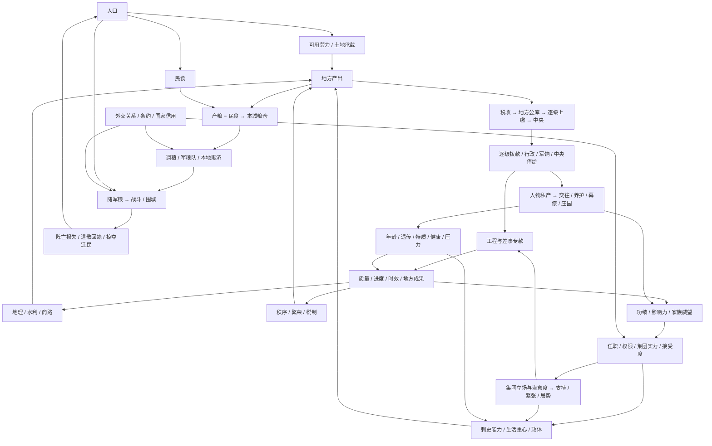

# 数值、资源与机制影响审计

日期：2026-09-24。范围：`src/core` 世界规则、`src/data` 配置及数值声明、存档校验、日／月结算与相关界面口径。检查方法为声明清单、生产／消费／修正／结算调用追踪、已有规则回归及新增守恒／边界测试；不是对所有可能局面的形式证明，也不是历史数值考证。

[数值字段清单](数值字段清单.md) 收录 269 项包含数字的声明，可用 `node scripts/audit-numeric-types.mjs` 重建。它包含嵌套对象、容器、命令参数、日期和版本，不等于 269 种资源。下列影响树覆盖玩法数值类别；具体参数以相应规则代码为准。

## 一、统一口径

- **存量**：钱、粮、人口、兵员、畜群、影响力等。有持有者、来源、去向、上限。
- **状态值**：秩序、繁荣、健康、压力、支持、合法性、关系等。不是支付钱包；变化必须影响实际规则。
- **派生值**：税收预测、接受度、能力、集团份额、工作效率等。即时计算，不重复记账。
- **进度与时间**：工作量、天数、截止日、冷却日，不能混用。“30 日一期”不等于自然月；年岁按剧本日历计算。
- **计数与元数据**：任务 ID、版本、随机种子、历史记录序号等，不能增加到资源栏。遗传脸型／五官数值用于表现，不要求全部转化成战斗加成。
- 核心钱粮及人口存量使用安全整数；金钱大账户上限 1,000,000，NPC 私人储备上限 1,000；状态多为 0—100。百分比修正保留小数，中间计算后按各规则取整，UI 不将预测显示成实际流水。
- 饱和上限不是免费资源来源：仓容外粮食损耗、封顶收益、运输损耗和公共服务支出属于模拟的消耗端。跨账户转账须先检查余额与整条路径容量，避免只转了一半就失败。

## 二、总影响树

## 三、逐类核对

| 数值／资源 | 来源、持有者 | 支出／修正／下游 | 主要规则与检查结论 |
| --- | --- | --- | --- |
| 私人钱 `Person.coins` | 家产、个人差事、俸禄、亲友支援、继承 | 庄园、交往、旅行筹办、养护、幕僚工资、考课 | world / construction / social / relationships；与公库隔离。俸禄按实际公库支出入账 |
| NPC 私人储备 `reserves` | 初值、周期经营、赠礼、工资 | 支援、索取人情、招募幕僚与工资 | relationships / retinue；本轮补齐中央官员、刺史、幕僚工资收款端，上限外不另存隐形钱包 |
| 私人行粮 `Person.food` | 市场整备、田庄、庄仓、幕僚整备 | 出行预付，行程中断退未用日份 | world / construction / mobility；单位为日份，不等同国家军粮。商贸采购是外部市场产出，不凭空扣另一公共库存 |
| 地方／中间／中央公款 | 人口税基、市场、政体与集团加成；统一 fiscal 账本 | 行政、拨款、军饷、官俸、国家交涉、迁民费用 | treasury / realm；转账不是新增税收，中央其他收支仅补登记未记部分，不重复计入 |
| 差事专款与公粮 | 中央批准后划入 | 办理按进度耗用，取消退未用部分 | assignments；`funds` 为已拨总额，`spent` 为累计耗用，不能当作两个余额相加；结案后不可再次退款 |
| 本城公粮 | 当期生产扣民食、粮队抵达、赈济交割 | 保管损耗、仓容、饥荒、调运、军队补给、赈济 | population / realm；本轮移除“中央无粮则所有城市扣秩序”的旧规则，避免与地方饥荒重复惩罚 |
| 中央公粮 | 初始储备、都城结余、国家援助、特定事件 | 公务粮款、动员、运输组织、都城补给 | population / realm / diplomacy；地方赈济只能使用本城储粮，都城可动用中央仓；不能隔空使用中央仓救另一城市 |
| 随军粮与军粮队 | 动员拨粮、本地补给、远程粮队、军需差事 | 逐日消耗、途中损耗、溃散／遣散返仓 | armyLogistics；优先本地，远程先扣源仓、到达才入军。脱离军队的返仓粮队用现有运输实体继续推进 |
| 人口 | 剧本参数、稳定增长、迁入、存活兵员回籍 | 民食、劳动、征募、死亡、迁出、掠夺 | population / realm；迁出与在途不重复算本地人口；损耗列为 sent − arrived。百万上限为模拟保护，不代表历史承载 |
| 兵员 | 动员、征募、操练补员，全部扣当地人口 | 饥饿、作战、溃散；遣散返还存活者 | realm / assignments / mobility；军队上限 600，不再由培训无偿造人 |
| 秩序 0—100 | 税制、赈济、巡察、地方公务 | 税粮效率、人口变化、迁移损耗、国家支持 | realm / population / serviceNeeds；粮仓空本身不是饥荒，民食实际短缺才扣秩序 |
| 繁荣 0—100 | 安定月结、营建和经世差事 | 税收、任务推荐、拨款评价 | realm / assignments；繁荣不是生产人口，不直接代替人口产粮 |
| 水利 0—10 | 农桑 +1、水利工程 +2 | 土地承载及粮产乘数 | population / regionalEconomy / realm；达到上限后不得把无收益标成新增等级 |
| 城市建筑 0—3 | 营建或中央公务竣工 | 市肆税收、城仓仓容与损耗、驿舍整备费用 | construction；同城中央营建和直接工程互斥，防止重复升级；城仓不产粮 |
| 庄园建筑 0—3 | 私人营建 | 主宅决定附属槽位；田庄、作坊、庄仓提供家产收益 | construction；庄园经济为独立家产抽象，没有宣称消耗城市劳力或公共库存 |
| 个人影响力 0—999 | 每期 +5、差事奖励 | 官职请任、军务授权、政治／军事行动 | personalInfluence / realm；本轮扩展到已登记关系人物。当前玩家标量与按人物映射是兼容镜像，不能相加；换人恢复其自身值 |
| 官僚功绩 0—100 | 在任考课、任务成果、主动考课、选官职掌 | 任职门槛、集团实力、拨款与继任评价 | government / court / assignments；功绩不是每次任官支付的货币，封顶不等于丢失未结算任务 |
| 家业名望 `renown` 0—999 | 周期、竣工 | 世业解锁、施压 | social；属于玩家家业可花费点数，与下项累计家族威望分开 |
| 家族威望与世族排行 | 已录族人月度、建设、交好、办差、联姻 | 外交能力、减压、婚姻、求官门槛与接受度 | family / clans；成员威望累加，排名按本国已知家族。未录家族关系不得伪造谱系和完整排名 |
| 管理／军事／外交／谋略 0—40 | 经历、特质、生活重心、技能、家族、遗传、健康 | 生产与造价、军力、交涉、任务效率、监察与控制 | social；本轮敏锐显性基因落实谋略 +2，并在能力来源显示 |
| 生活经验、技能点、特长 | 每日研习、特质契合、导师活动、研习事件 | 每 120 XP 一点，扣已解锁技能数；技能作用于各公式 | lifestyle；三路线各最多 600 XP；长期研习实际只可达到 +1，移除此前不可到达的 +3 上限表达，不改原成长速度 |
| 性格与遗传 | 登记特质／双等位基因，先天表现 | 能力、交往、压力、外观与健康 | social / genetics / life；体健降低患病／死亡风险，敏锐影响谋略；五官不额外给予政治能力 |
| 健康、疾病、照料、年龄 | 年龄容量、康复、养护 | 疾病严重度影响能力与办理，重病暂停，死亡触发继承／撤职 | life；严重度 1—3，健康 0—100；死亡不是历史年份强制事件 |
| 压力 0—100 | 勤勉营建、强令推进、交往、研习 | 高压降低能力／学习、提高疾病风险；休息与家族加成减压 | social / lifestyle / life；压力为玩家状态，NPC 督办代价改由工作量体现，不能虚构 NPC 压力条 |
| 好感、关系记忆、人情与接受度 | 特质、亲族、婚姻、朋友／仇敌、国关系、互动 | 请求、任职、结党、私援、效忠、计谋概率 | social / relationships；好感不等于接受概率。人情可消耗，关系状态不能重复加进记忆 |
| 忠诚、摄政掌控、计谋概率 | 宣誓、控制计谋、交情与权力基础 | 个人统属、傀儡控制、恢复亲政 | relationships；均有生效门槛、冷却或清理条件，权力基础失效不能继续使用旧控制 |
| 合法性／支持 0—100 | 国政、秩序、议事、集团态度与外交承认 | 改革、动员、政体稳定、改朝换代 | government / court；本轮同政权同类行动的即时集团反应每 30 日一次，避免切税和极小额迁民无限刷支持 |
| 集团实力／份额／满意度 | 成员功绩、职位、人口税基、军队、世族、临时加成；份额即时算 | 国策、集团诉求、紧张／支持、行动执行效率 | court / politicalActions；君主协调而不普通结党。移除没有任何扣费消费者的 `cost` 派生字段，避免伪装为实际费用 |
| 积弊／紧张／局势阶段 | 集团诉求、财政、边境、国策、监察 | 政体税收军费修正、改革阻力、王朝稳定 | court；阶段是状态派生，不另重复扣一次相同奖励 |
| 畜群 0—1000、宫帐、契约 | 草场与季节、整备 | 游牧／宫帐动员、部落支持、封建税／兵倾斜 | government；改革进度按权限、条件推进，暂停与取消不重复退费 |
| 国家关系、信用、条约和朝贡 | 使团、承认、会盟、违约、战争、掠夺 | 通行、战争权限、贸易邻接、国家交涉、周期朝贡 | diplomacy；期限失效会清理；婚姻不等同国家同盟，外交援助仍按协议抽象结算，不伪装为地图粮队 |
| 士气、战分、围城进度 | 军粮、训练、胜败、占领 | 伤害、溃散、和约、控制变化 | realm；控制不自动修改法理所属，和约按实际战果结算。军粮单位和士气不是同一种补给值 |
| 差事需求、质量、效率、贡献 | 地方实际需求、拟案、季议、能力、合作、政治与阻碍选择 | 预算、工期、成果、考绩、推荐排序 | assignments / serviceNeeds；预估复用真实工作量，质量只放大已定义的成果，固定建筑等级不放大 |
| 天水粮务独立进度 | 专案预算／采购与运送路线 | 军民接济、考绩、官员关系 | duties；本轮补齐办结后地方仓入粮，避免“接济军民”但城市粮储不变。采购为外部购入 90，转运为实际专拨量；先给军队最多 60，余粮入城仓 |
| 旅行、活动与任命日期 | 道路、权限、文书、会面约定 | 行粮、到场权限、过期失败、赴任生效 | world / mobility / offices；时间推进以日为单位；地图旗帜是状态投影，不是独立进度来源 |
| 种子、ID、版本与记录 | 初始化与状态推进 | 确定性随机、唯一实体、迁移、回放／保存 | save 与各 *Save；拒绝非整数、NaN、无穷、非法关系与坏路径，不把版本号作为游戏资源 |

## 四、本轮确认问题与修复

| 问题 | 修复 | 验证落点 |
| --- | --- | --- |
| 同城仓未纳入军粮调度，可能派出不必要远程队伍 | 显式处理本地补给，空路径不创建队伍 | 本地补给前后粮食守恒、可存档 |
| 军队解除后在途粮队随对象消失 | 转为独立返仓运输，真实日推进、5% 损耗；无法保全原仓与路线时记录损失 | 遣散后先在途、次日／路线完成才入仓 |
| 遣散粮食瞬移中央；人口可能超过上限 | 随军粮归驻地仓，人口限制上限 | 驻地与中央存量分别验证 |
| 本地民食充足仍被中央零粮扣秩序 | 移除旧中央粮荒惩罚，饥荒由地方结算负责 | 中央空／满但同样地方条件的秩序一致 |
| 普通赈济直接从异地中央扣粮 | 本城储粮支付，都城才可动用中央仓 | 非都城无地方粮时拒绝；有粮只扣本地 |
| 重复同税制或来回切换刷政治收益 | 同税制拒绝，集团即时反应按领域 30 日限次 | 重复命令不叠加，冷却可持久化 |
| 新任职登记人物得不到影响力 | 扩展人物登记与旧档补零 | 陈霸先积累、旧档余额不变、幂等迁移 |
| 幕僚、NPC 官俸只有支出没有收入；玩家城市工资游离在行政预测之外 | 实际工资分别入私人账户；刺史俸禄纳入城市行政支出，中央工资由实际扣款驱动 | NPC 刺史／中央官、零国库、幕僚周期只结一次 |
| 公库负数／非整数底层支出与逐级中途失败 | 金额校验；整条路径容量预检；征税回拨考虑路径可容纳额 | 非法金额不变更状态，满中间库不部分转账 |
| 退款可能推高中央存量超过存档上限 | 退回按剩余库容入账，超限损失写入结案与资金记录，不生成非法余额 | 满公库取消后可存档，损失可查 |
| 先天敏锐只有表现无数值消费者 | 显性敏锐谋略 +2，能力明细显示 | 隐性不生效、显性生效、来源可查 |
| 无消费者的政治费用、不可达的研习上限 | 删除空转字段，将研习可达上限明确为 +1 | 构建与生活重心既有回归 |
| 天水粮务未接入新地方粮食模型 | 专拨／采购粮分配军队和本地仓，受仓容约束 | 专案既有生命周期回归及新增交割验证 |

## 五、仍须区分的边界

1. 这是策略游戏，不是封闭市场总均衡模拟。私人整备、采购粮、贸易回款、初始库存及事件收益有明确外部来源；不应误判为必须从另一玩家钱包扣出的转账。资源自然增长也不要求总量恒定；纯转移则检查来源、在途、去向、损耗。
2. 历史家族、婚姻与人物数据不完整；已登记家族之外的人物不能用推测的郡望或祖先补齐加成。新生儿出生全流程与完整 NPC 生活技能 AI 不在当前已实现范围。遗传算法存在不等于已实现完整生育模拟。
3. 家业名望和家族威望、个人影响力和国家支持、国家关系和接受度保留不同实体与用途，不合并成一个模糊的“威望”。
4. 外交协议援助、事件救济和公共采购仍有抽象结算；地图运输仅代表显式人口／调粮／军粮队。将所有贸易与国家援助改为可截击商队属于新增物流设计，不能仅为了数值审计把成熟入口改成另一玩法。
5. 静态审计和有限回归不能保证永远没有经济最优解；实际收益强弱、后期通胀与派系体验仍需长局人工游玩评估。本轮修复确定的资源丢失、重复触发、登记缺口及校验问题，不宣称完成历史经济校准。

## 六、验证记录

- 新增 `numericAudit.test.ts`：本地补给、返仓、地方饥荒、赈济来源、政治反复触发、人物影响力迁移、工资收款、金额／路径边界、遗传能力与三国逐日长局校验。
- 三个主要执政者各模拟最多 360 日，每日验证世界状态并进行存档往返；该测试不证明玩家所有选择组合均可达。
- 全量 473 项测试／52 个文件通过，生产构建通过（保留既有大包体提示）；UI 验收仍由用户完成，不运行浏览器自动化。
