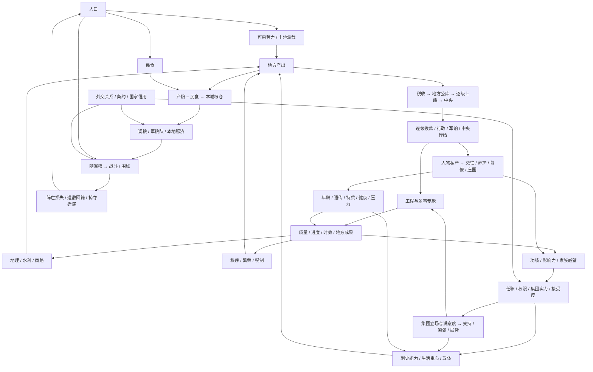

# 数值、资源与机制影响审计

日期：2026-09-24。范围：`src/core` 世界规则、`src/data` 配置及数值声明、存档校验、日／月结算与相关界面口径。检查方法为声明清单、生产／消费／修正／结算调用追踪、已有规则回归及新增守恒／边界测试；不是对所有可能局面的形式证明，也不是历史数值考证。

[数值字段清单](数值字段清单.md) 收录包含数字的声明，当前条目数见清单，可用 `node scripts/audit-numeric-types.mjs` 重建。它包含嵌套对象、容器、命令参数、日期和版本，声明数量不等于资源种类数。下列影响树覆盖玩法数值类别；具体参数以相应规则代码为准。

## 一、统一口径

- **存量**：钱、粮、人口、兵员、畜群、影响力等。有持有者、来源、去向、上限。
- **状态值**：秩序、繁荣、健康、压力、支持、合法性、关系等。不是支付钱包；变化必须影响实际规则。
- **派生值**：税收预测、接受度、能力、集团份额、工作效率等。即时计算，不重复记账。
- **进度与时间**：工作量、天数、截止日、冷却日，不能混用。“30 日一期”不等于自然月；年岁按剧本日历计算。
- **计数与元数据**：任务 ID、版本、随机种子、历史记录序号等，不能增加到资源栏。遗传脸型／五官数值用于表现，不要求全部转化成战斗加成。
- 核心钱粮及人口存量使用安全整数；金钱大账户上限 1,000,000，NPC 私人储备与个人钱包上限均为 1,000,000；状态多为 0—100。百分比修正保留小数，中间计算后按各规则取整，UI 不将预测显示成实际流水。
- 饱和上限不是免费资源来源：仓容外粮食损耗、封顶收益、运输损耗和公共服务支出属于模拟的消耗端。跨账户转账须先检查余额与整条路径容量，避免只转了一半就失败。

## 二、总影响树

## 三、逐类核对

| 数值／资源 | 来源、持有者 | 支出／修正／下游 | 主要规则与检查结论 |
| --- | --- | --- | --- |
| 私人钱 `Person.coins` | 家产、个人差事、俸禄、亲友支援、继承 | 庄园、交往、旅行筹办、养护、幕僚工资、考课 | world / construction / social / relationships；与公库隔离。俸禄按实际公库支出入账 |
| NPC 私人储备 `reserves` | 初值、周期经营、赠礼、工资 | 支援、索取人情、招募幕僚与工资 | relationships / retinue；本轮补齐中央官员、刺史、幕僚工资收款端，上限外不另存隐形钱包 |
| 私人行粮 `Person.food` | 市场整备、田庄、庄仓、幕僚整备 | 出行预付，行程中断退未用日份 | world / construction / mobility；单位为日份，不等同国家军粮。商贸采购是外部市场产出，不凭空扣另一公共库存 |
| 地方／中间／中央公款 | 人口税基、市场、政体与集团加成；统一 fiscal 账本 | 行政、拨款、军饷、官俸、国家交涉、迁民费用 | treasury / realm；转账不是新增税收，中央其他收支仅补登记未记部分，不重复计入 |
| 差事专款与公粮 | 中央批准后划入 | 办理按进度耗用，取消退未用部分 | assignments；`funds` 为已拨总额，`spent` 为累计耗用，不能当作两个余额相加；结案后不可再次退款 |
| 本城公粮 | 当期生产扣民食、粮队抵达、赈济交割 | 保管损耗、仓容、饥荒、调运、军队补给、赈济 | population / realm；本轮移除“中央无粮则所有城市扣秩序”的旧规则，避免与地方饥荒重复惩罚 |
| 中央公粮 | 初始储备、都城结余、国家援助、特定事件 | 公务粮款、动员、运输组织、都城补给 | population / realm / diplomacy；地方赈济只能使用本城储粮，都城可动用中央仓；不能隔空使用中央仓救另一城市 |
| 随军粮与军粮队 | 动员拨粮、本地补给、远程粮队、军需差事 | 逐日消耗、途中损耗、溃散／遣散返仓 | armyLogistics；优先本地，远程先扣源仓、到达才入军。脱离军队的返仓粮队用现有运输实体继续推进 |
| 人口 | 剧本参数、稳定增长、迁入、存活兵员回籍 | 民食、劳动、征募、死亡、迁出、掠夺 | population / realm；迁出与在途不重复算本地人口；损耗列为 sent − arrived。百万上限为模拟保护，不代表历史承载 |
| 兵员 | 动员、征募、操练补员，全部扣当地人口 | 饥饿、作战、溃散；遣散返还存活者 | realm / assignments / mobility；军队上限 600，不再由培训无偿造人 |
| 秩序 0—100 | 税制、赈济、巡察、地方公务 | 税粮效率、人口变化、迁移损耗、国家支持 | realm / population / serviceNeeds；粮仓空本身不是饥荒，民食实际短缺才扣秩序 |
| 繁荣 0—100 | 安定月结、营建和经世差事 | 税收、任务推荐、拨款评价 | realm / assignments；繁荣不是生产人口，不直接代替人口产粮 |
| 水利 0—10 | 农桑 +1、水利工程 +2 | 土地承载及粮产乘数 | population / regionalEconomy / realm；达到上限后不得把无收益标成新增等级 |
| 城市建筑 0—3 | 营建或中央公务竣工 | 市肆税收、城仓仓容与损耗、驿舍整备费用 | construction；同城中央营建和直接工程互斥，防止重复升级；城仓不产粮 |
| 庄园建筑 0—3 | 私人营建 | 主宅决定附属槽位；田庄、作坊、庄仓提供家产收益 | construction；庄园经济为独立家产抽象，没有宣称消耗城市劳力或公共库存 |
| 个人影响力 0—999 | 每期基础 5＋最高有效职权 0—10＋辖区治理 0—2＋在世忠诚效忠者 0—4；差事奖励另计 | 常规合格补缺免费；请任、撤换、破格、军务授权及政治／军事行动 | personalInfluence / realm；本轮扩展到已登记关系人物。当前玩家标量与按人物映射是兼容镜像，不能相加；换人恢复其自身值 |
| 官僚功绩 0—100 | 在任考课、任务成果、主动考课、选官职掌 | 任职门槛、集团实力、拨款与继任评价 | government / court / assignments；功绩不是每次任官支付的货币，封顶不等于丢失未结算任务 |
| 家业名望 `renown` 0—999 | 周期、竣工 | 世业解锁、施压 | social；属于玩家家业可花费点数，与下项累计家族威望分开 |
| 家族威望与世族排行 | 已录族人月度、建设、交好、办差、联姻 | 外交能力、减压、婚姻、求官门槛与接受度 | family / clans；成员威望累加，排名按本国已知家族。未录家族关系不得伪造谱系和完整排名 |
| 管理／军事／外交／谋略 0—40 | 经历、特质、生活重心、技能、家族、遗传、健康 | 生产与造价、军力、交涉、任务效率、监察与控制 | social；本轮敏锐显性基因落实谋略 +2，并在能力来源显示 |
| 生活经验、技能点、特长 | 每日研习、特质契合、导师活动、研习事件 | 每 120 XP 一点，扣已解锁技能数；技能作用于各公式 | lifestyle；三路线各最多 600 XP；长期研习实际只可达到 +1，移除此前不可到达的 +3 上限表达，不改原成长速度 |
| 性格与遗传 | 登记特质／双等位基因，先天表现 | 能力、交往、压力、外观与健康 | social / genetics / life；体健降低患病／死亡风险，敏锐影响谋略；五官不额外给予政治能力 |
| 健康、疾病、照料、年龄 | 年龄容量、康复、养护 | 疾病严重度影响能力与办理，重病暂停，死亡触发继承／撤职 | life；严重度 1—3，健康 0—100；死亡不是历史年份强制事件 |
| 压力 0—100 | 勤勉营建、强令推进、交往、研习 | 高压降低能力／学习、提高疾病风险；休息与家族加成减压 | social / lifestyle / life；压力为玩家状态，NPC 督办代价改由工作量体现，不能虚构 NPC 压力条 |
| 好感、关系记忆、人情与接受度 | 特质、亲族、婚姻、朋友／仇敌、国关系、互动 | 请求、任职、结党、私援、效忠、计谋概率 | social / relationships；好感不等于接受概率。人情可消耗，关系状态不能重复加进记忆 |
| 忠诚、摄政掌控、计谋概率 | 宣誓、控制计谋、交情与权力基础 | 个人统属、傀儡控制、恢复亲政 | relationships；均有生效门槛、冷却或清理条件，权力基础失效不能继续使用旧控制 |
| 合法性／支持 0—100 | 国政、秩序、议事、集团态度与外交承认 | 改革、动员、政体稳定、改朝换代 | government / court；本轮同政权同类行动的即时集团反应每 30 日一次，避免切税和极小额迁民无限刷支持 |
| 集团实力／份额／满意度 | 成员功绩、职位、人口税基、军队、世族、临时加成；份额即时算 | 国策、集团诉求、紧张／支持、行动执行效率 | court / politicalActions；君主协调而不普通结党。移除没有任何扣费消费者的 `cost` 派生字段，避免伪装为实际费用 |
| 积弊／紧张／局势阶段 | 集团诉求、财政、边境、国策、监察 | 政体税收军费修正、改革阻力、王朝稳定 | court；阶段是状态派生，不另重复扣一次相同奖励 |
| 畜群 0—1000、宫帐、契约 | 草场与季节、整备 | 游牧／宫帐动员、部落支持、封建税／兵倾斜 | government；改革进度按权限、条件推进，暂停与取消不重复退费 |
| 国家关系、信用、条约和朝贡 | 使团、承认、会盟、违约、战争、掠夺 | 通行、战争权限、贸易邻接、国家交涉、周期朝贡 | diplomacy；期限失效会清理；婚姻不等同国家同盟，外交援助仍按协议抽象结算，不伪装为地图粮队 |
| 士气、战分、围城进度 | 军粮、训练、胜败、占领 | 伤害、溃散、和约、控制变化 | realm；控制不自动修改法理所属，和约按实际战果结算。军粮单位和士气不是同一种补给值 |
| 差事需求、质量、效率、贡献 | 地方实际需求、拟案、季议、能力、合作、政治与阻碍选择 | 预算、工期、成果、考绩、推荐排序 | assignments / serviceNeeds；预估复用真实工作量，质量只放大已定义的成果，固定建筑等级不放大 |
| 天水粮务独立进度 | 专案预算／采购与运送路线 | 军民接济、考绩、官员关系 | duties；本轮补齐办结后地方仓入粮，避免“接济军民”但城市粮储不变。采购为外部购入 90，转运为实际专拨量；先给军队最多 60，余粮入城仓 |
| 旅行、活动与任命日期 | 道路、权限、文书、会面约定 | 行粮、到场权限、过期失败、赴任生效 | world / mobility / offices；时间推进以日为单位；地图旗帜是状态投影，不是独立进度来源 |
| 种子、ID、版本与记录 | 初始化与状态推进 | 确定性随机、唯一实体、迁移、回放／保存 | save 与各 *Save；拒绝非整数、NaN、无穷、非法关系与坏路径，不把版本号作为游戏资源 |

## 四、本轮确认问题与修复

| 问题 | 修复 | 验证落点 |
| --- | --- | --- |
| 同城仓未纳入军粮调度，可能派出不必要远程队伍 | 显式处理本地补给，空路径不创建队伍 | 本地补给前后粮食守恒、可存档 |
| 军队解除后在途粮队随对象消失 | 转为独立返仓运输，真实日推进、5% 损耗；无法保全原仓与路线时记录损失 | 遣散后先在途、次日／路线完成才入仓 |
| 遣散粮食瞬移中央；人口可能超过上限 | 随军粮归驻地仓，人口限制上限 | 驻地与中央存量分别验证 |
| 本地民食充足仍被中央零粮扣秩序 | 移除旧中央粮荒惩罚，饥荒由地方结算负责 | 中央空／满但同样地方条件的秩序一致 |
| 普通赈济直接从异地中央扣粮 | 本城储粮支付，都城才可动用中央仓 | 非都城无地方粮时拒绝；有粮只扣本地 |
| 重复同税制或来回切换刷政治收益 | 同税制拒绝，集团即时反应按领域 30 日限次 | 重复命令不叠加，冷却可持久化 |
| 新任职登记人物得不到影响力 | 扩展人物登记与旧档补零 | 陈霸先积累、旧档余额不变、幂等迁移 |
| 幕僚、NPC 官俸只有支出没有收入；玩家城市工资游离在行政预测之外 | 实际工资分别入私人账户；刺史俸禄纳入城市行政支出，中央工资由实际扣款驱动 | NPC 刺史／中央官、零国库、幕僚周期只结一次 |
| 公库负数／非整数底层支出与逐级中途失败 | 金额校验；整条路径容量预检；征税回拨考虑路径可容纳额 | 非法金额不变更状态，满中间库不部分转账 |
| 退款可能推高中央存量超过存档上限 | 退回按剩余库容入账，超限损失写入结案与资金记录，不生成非法余额 | 满公库取消后可存档，损失可查 |
| 先天敏锐只有表现无数值消费者 | 显性敏锐谋略 +2，能力明细显示 | 隐性不生效、显性生效、来源可查 |
| 无消费者的政治费用、不可达的研习上限 | 删除空转字段，将研习可达上限明确为 +1 | 构建与生活重心既有回归 |
| 天水粮务未接入新地方粮食模型 | 专拨／采购粮分配军队和本地仓，受仓容约束 | 专案既有生命周期回归及新增交割验证 |

## 五、仍须区分的边界

1. 这是策略游戏，不是封闭市场总均衡模拟。私人整备、采购粮、贸易回款、初始库存及事件收益有明确外部来源；不应误判为必须从另一玩家钱包扣出的转账。资源自然增长也不要求总量恒定；纯转移则检查来源、在途、去向、损耗。
2. 历史家族、婚姻与人物数据不完整；已登记家族之外的人物不能用推测的郡望或祖先补齐加成。新生儿出生全流程与完整 NPC 生活技能 AI 不在当前已实现范围。遗传算法存在不等于已实现完整生育模拟。
3. 家业名望和家族威望、个人影响力和国家支持、国家关系和接受度保留不同实体与用途，不合并成一个模糊的“威望”。
4. 外交协议援助、事件救济和公共采购仍有抽象结算；地图运输仅代表显式人口／调粮／军粮队。将所有贸易与国家援助改为可截击商队属于新增物流设计，不能仅为了数值审计把成熟入口改成另一玩法。
5. 静态审计和有限回归不能保证永远没有经济最优解；实际收益强弱、后期通胀与派系体验仍需长局人工游玩评估。本轮修复确定的资源丢失、重复触发、登记缺口及校验问题，不宣称完成历史经济校准。

## 六、验证记录

- 新增 `numericAudit.test.ts`：本地补给、返仓、地方饥荒、赈济来源、政治反复触发、人物影响力迁移、工资收款、金额／路径边界、遗传能力与三国逐日长局校验。
- 三个主要执政者各模拟最多 360 日，每日验证世界状态并进行存档往返；该测试不证明玩家所有选择组合均可达。
- 全量 473 项测试／52 个文件通过，生产构建通过（保留既有大包体提示）；UI 验收仍由用户完成，不运行浏览器自动化。

## 065 内容扩充后的适配

- 人口来源改为 `populationEstimates.ts` 的县域及腹地初值；魏尹郡级合计约束县级分配，其余为带区间的推定。当前人口仍由游戏结算改变，初值不覆盖旧局。
- 承载量按地域基础与开局县域规模取较高值，向下游产粮、粮需、税收、行政支出、仓容传递。详细估计边界见《546年区划人物与人口扩充》。不把收录县人口合计当全国人口。
- 地方集团实力人口分母从千人量级调整为万人量级，保留 60 的总上限；未成年不贡献政治实力。基础稳定因素与集团压力同时结算，轻微压力不再关闭全部自然缓和。
- 新人物进入家族累计贡献、薪俸、影响力、任职、同族延医及公共继承。族谱死者不进入在世模拟，架空家系不挂接历史父母。原有私人可玩家业交接边界不变。
- 内容版本升级只新增地点、人物与零余额账户，不回填旧城市人口、不倒算税粮及威望。原有数据缺失或损坏依然拒绝。
- 数值声明索引更新为 273 项，包含内容估计字段；它们不是新增 273 种资源。

## 066：州郡县官制与地方财政

- 县人口／生产 → 单份县税 → 县留用 35% → 郡留上缴额 10% → 州留上缴额 10% → 中央；取消原 35% 重复回拨。各次转移向下取整，流量与存量分开，旧余额不再次征税。
- 稳定行政 ID 生成职位父链；县城共用原任职与钱包。州郡只有汇总人口，没有第二份人口或产粮结算。旧县中转余款合并一次，容量不足拒绝，不截断。
- 个人影响力 → 授官 20／举荐和请任 10／代行 10 → 文书 → 真实赴任 → 原职交接或至多三职兼领；授权、控制、存活和实际执政身份在到任时复核。撤换的关系／支持成本和破格支持／秩序成本在相应节点一次结算。
- 州郡主官能力与兼职负担 → 统筹修正（−10% 至 +10%）→ 县税；任内秩序、繁荣变化和人口保全 → 每季功绩（−5 至 +8）→ 晋升和中央请任。各县基线仅用于考绩，不再生成资源。
- 县、郡、州公库 → 拨付下级／上级申请 → 当前审批者实际公库 → 下级公库；不足不得暗扣中央。州郡工资 12／8 钱由本级账户扣除并转入人物钱包，收款上限限制实际支付。
- 兼任辖区对集团税基按地点去重；职位变动同步到幕府、肖像、差事凭证与请款审批。任命来源不修改行政父关系；死亡、失守、改朝、改投和到期分别撤任或停权。
- 新存档验证包含地方职位引用、申请 ID／重复请求、代行时间、任期基线、文书与钱款范围；新增守恒、迁移幂等与长局回放回归。参考细则见 `地方官制与县域治理.md`。

### 三年铨选（2026-09-25）

此节为当时检查点；评价公式与资格通道已由文末 2026-09-28 国家治理优化替换，费用、轮次与文书流程延续。

- 功绩（0–100）、个人威望（既有成员贡献）、家族威望（成员贡献汇总）→ 铨选分数（0–150）→ 州／郡／县推荐、晋升或调任 → 实际文书与赴任 → 新岗位治理与后续考绩。清单中的数值是编制时快照，不能作为第二套可支配资源。
- 个人影响力 → 每处修改 20、交换两处 40 → 修改清单；先验证后扣费，拒绝、重编不退已付费用，不因批准留任重复收费。
- 批量调任仍调用现有撤换和破格代价，先释放相关旧席位再颁文书，防止交换覆盖；有效控制、效忠、生命、忙碌和执政权限在批准时再次检查。
- 年份／创建日／当前轮状态 → 549 年起每三年触发、NPC 七日后审批、玩家待批暂停；改朝清理旧案，读档复现待批，不追溯旧轮次。每国只保留最近一轮，不无限累积审批对象。
- 新人物独立家族初始威望为零，功绩 20 为剧本设计值；不借用历史世族贡献，不凭新增名录增发国库资金。旧档迁移保留原有资产和任官。

## 2026-09-26：协同任务、家业交易、债权与军情

| 对象 | 类型、持有者与边界 | 影响链与结算 |
|---|---|---|
| 操作会话序号 | 元数据；存档保存各会话高水位，不是玩法资源 | UI 指令 → 候选世界 → 成功保存后记录；重试不重扣，同序号冲突拒绝 |
| 债权 `original/remaining/paid/offset` | 金钱请求权，非现金；整数非负，原额=未清+实付+抵销 | 原出资人实际垫付/借出 → 债权 → 每月 1 日实际余额支付；收款满额或付款不足顺延；继承/吞并映射，合一账户抵销 |
| 赔款兼容投影 | `realm.reparations` 关联统一债权编号 | 旧档首次推进迁移；展示未清/下期；仅统一债权执行付款，不再另一套扣款 |
| 跨县协调及季报 | 目标、政策、独立任务 ID；2—8 县；季报不是第二份钱粮 | 各县实支/成果 → 季报快照 → 委任人共同考课；成功质量/失败分别影响，稳定来源只结一次；承办成果不复制 |
| 教育学资与成长 | 私款→教师；30 钱/期、30 有效驻留日/期；三期 +1、最多 +3 | 同城且无公务军事冲突才计工；异地/离任/死亡/资金不足分别暂停或结束；实际能力查询读取成长 |
| 家资与亲属借款 | 现钱转移，不增加双方总资产 | 配偶一次实际交付；亲属借款生成等额请求权，借入钱不是新增财富 |
| 商品库存 | 私人事业所有；粮食50/批、农具10/批为游戏参数 | 真实地方购粮（保留民食）或驻留生产（抽象材料劳务支出）→库存→押运→收货/损耗；取消不复制在途货物 |
| 商旅托管价款 | 买方地方公库预付；到货价款上限等于预付 | 买方减款→托管；到货增加粮食/农具效益、卖方实收；未交付退款有余额记录；护卫是实际服务支出而非凭空生成军队 |
| 伤俘人口池 | 与现役、城市居民互斥；按所属、地点、看押军队保存 | 现役减员→伤员/俘虏/阵亡/离散；伤员耗2粮/人归民、释放与离散安置归民；不自动恢复现役；看押军队消失后可释放安置 |
| 战斗阶段/侦报 | 状态及有日期的估计，非额外兵力 | 交锋日与士气决定阶段；固定有界修正；斥候消耗5粮并按往返日出报告，只展示数量区间与时效 |
| 军粮分配 | 本地实粮与中央存粮 | 同仓部队按缺口比例分配，整数余量轮转；地方保留2期民食；日耗仍由已有军粮结算扣除一次 |
| 押运战利品 | 敌方原地方公库→押运实物钱款→回仓 | `initial=coins+delivered+lost`；截获进入实际敌库，容量不足保留；归仓后受任统帅10%形成债权、实际支付后才成为私财 |

已补专门守恒、重复命令、读档、仓容不足、失败退回、同城分配顺序、有效受教时间及季报考课去重检查。**未覆盖的数值机制仍包括装备池、真正逐批物流、哗变军、动态分裂国家和不限量的战争组合条款，不能把现有字段审计当作这些机制已经落地。** 不将本轮定向检查当作完整回归、长局或平衡结论。

## 2026-09-26 实名外交使团

- 发起人 `actor` 与实际使者 `envoy` 分离。条约、国家信用与安全通行仍属于原发起方；使者不会取代君主成为条约受益人。
- 外交能力 → 交涉日数 `max(2,14-floor(能力/2))`；实际道路日数另计，出使报价包含行程与交涉。一般交涉成功率为 `clamp(50+2×(接受度−门槛),5,95)%`，接受度中使用使者能力，其他国家关系因素沿用已有分解；修好保留必然接受的基础规则。以上均为游戏参数。
- 派遣时沿用一次性国库使团支出及个人影响力，不另扣私人行粮、不返还已支出旅费。人员使用现有人物位置和 Journey；行程由外交推进一次，普通移动不重复推进。到首都才开始交涉，成功／拒绝后沿合法道路返程，返抵出发地才释放占用。
- 任命、差事、幕府招募、随军和玩家自由出行检查使团占用。亡故、效忠改变、首都失守、国号／执政变化与道路中断终止或返程，不传送人物；道路中断时留在真实驻地并写入外交往事。
- `negotiation` 为办理日数，`arrived/lastTravel/returnStarted` 为日期元数据，`due` 为当前阶段预计完成日期，`home` 为出发地。旧档无实名使者的在途记录按旧逻辑结清，新派遣全部实名。存档校验人物、日期、目标路线与同一使者不可重复占用。
- 定向规则覆盖实际到都、返程、能力差异、费用拒绝原子性、重复推进、读档一致、失效人员与首都失守；不作为完整回归或长期平衡结论。

### 2026-09-26 征募扩编与损耗解释

- 征募新增可选目标军队 ID，只引用既有编制，不是新兵员池。校验指挥权、同公库、同城停驻、非战役／内战／运输中与容量后，从原人口扣 200、地方粮仓扣 60、公库扣原兵种费用；目标现役加 200、随军粮加 60，兵团 ID 唯一，集训取原期限与新期限较晚者。无目标时保留旧建军路径与旧档。
- 随军粮可用天数按库存除以每日向上取整口粮给出保守值，不计未来未抵达补给；结算仍沿用分数余量，无重复消费。欠饷只解释既有士气与延期，不冒充直接兵员损失。
- 断粮纪事记录实际需求、库存与 takeCasualties 返回的实际减员；战斗损失读取既有战斗记录。不新增重复伤亡池，不通过 UI 估计改写真实消耗。

### 2026-09-26 逐军统帅

- armyCommanders 以既有军队 ID 引用人物，不新增兵力或财政账户。一个人物不得同时统领两军；旧 commanders 只兼容该政权第一军，新命令可指定实际军队。重复／悬空存档映射拒绝。
- 任命检查权限、驻地、成年、健康、效忠及任务占用；军事能力、玩家军令与军队绑定。随军位置跟随实际行程；解散／免任释放行程，战役接管与结束在两种统帅来源之间交接，不重复绑定。死亡、失去效忠和吞并清理关联，溃散延续原统帅受伤规则。
- 兵力、士气、军粮、集训与倒计时均为原状态投影；军队卡片不结算资源，不新造费用。城市征募和单位编制共用原征募整编命令。

### 2026-09-27 回归修正

- 使团人员占用持续到返抵；等待答复和返程中的使者不能兼任公款监察人。使团已完成答复并返程时，原目标国可由另一名空闲使者接办新任务，仍受使团名额与冷却约束。
- NPC 军令在日结当日派发时只建立行程，次日开始计算道路进度；交战阻滞继续顺延起程日。存档中的起程日、已行天数与军队位置保持一致，议和后撤军仍沿真实道路进行。

### 2026-09-27 上级处理下级事务

- **辖区权限（派生）**：税制、粮赈、平粜与营建委任按人物当前效忠、实际执政或在任地方父链、城市法理归属与实际控制重算。名义君主、失职上级、异国或内战对方不能沿用旧权；治理权没有扩大授免权。
- **钱粮与状态**：粮赈仍从本城粮仓扣 50，只有都城可补中央粮；平粜仍只扣本城公库 20。税制即时改状态，下期税收和秩序按现行税制结算。上级下令不合并中央、州郡县、公务专款及私财。
- **营建与公务**：上级选人和方案后建立同一营建差事，先核准主管公库及粮仓的专款，再由实际承办人赴任、办理、结案并按贡献考绩；旧直接工程与差事仍互斥。上级可批定方案、下令开办、处置阻碍、追加 20 公款、延期、改派与撤回；一次阻碍不重复追加。上级强令他人办理增加工作量，不把点击操作计为自己的压力或功绩。以上复用既有字段、退款与存档校验，没有新增资源种类。

### 2026-09-27 差事奏事与例行授权

- **例行授权（权限状态）**：在任辖区主管可按赈济、市肆、城仓、驿舍类型授权后续新案。受控辖区内、预算不超过该类常额、秩序至少 40、基础质量至少 85 且原付款公库足额时，原主管自动核准与结案；追加预算、失守、换主管、超额或质量不足均需人工决策。收回同类授权同步停用尚在办案件的自动核准；失去职权后授权清除，复任不自动恢复。授权不划转钱粮，审批仍按原主管的公库和粮仓实时扣付。
- **奏事与结案快照（信息状态）**：赈济和营建呈报中的当地粮储、民食、秩序、税收及全境合计取自当前世界；方案钱粮、有效办理日和质量复用差事估算。新案记录当地受理时状态，结案记录结算后状态；两者的差额明确标为同期变化，直接成果仍以结案 `effects` 和真实资金流水为准。快照只供解释，不参与第二次结算或国库收入。

### 2026-09-27 地方财政、私财、疾病与辞官

- **公库与薪俸（存量转移）**：县税经郡、州留用后入中央；中央有款时沿实际科层拨付州郡官俸，再由地方公库支付到在任者私财。中央不足才动用地方留用，不能透支或增发。拨付受整条路径容量限制；内战起兵地区不获中央补助。中央预算预测同步纳入这项费用。秦州初始税基每期约留用4钱，原12钱州俸直接吃尽留用的问题由此消除，贫困中央仍可能欠付。
- **拨款审批（派生评分）**：原“余额不足申请额三倍一律−20”改为充裕+15、足额+5、不足−20，空公库纳入急需；实际余额仍是执行硬条件。NPC不再仅因低于储备阈值无差别请款，赈济按秩序和缺口申请，同一上级待批请求及差事分别限制积压2件。玩家审批不被自动代办。
- **私人捐输（纯转移）**：展示中央、州、郡、县全部有效公库，并优先本人辖区；扣私人现钱、入指定公库、记两侧既有记录，不增加功绩。允许连续转账，但秩序/性格附带收益仍每90日至多一次，防止拆分金额刷收益。首次正常操作可建立账簿，校验失败不建立；旧存档不补发收入。
- **家产收益（生产）**：沿用庄园每月 1 日收入4钱、作坊每级6钱，田庄每级6日份、庄仓每级3日份的原规则；概览直接复用结算函数，区分基础结余与尚未实付官俸、事业合同。私财页管理持家、研习、事业、公私往来与监察；没有新增第二套钱包。
- **疾病（暂时状态）**：按月判定，年轻无压力基础风险由2.5%调为0.7%，有年龄/压力/遗传活力修正并限0.2%—5%；这是游戏参数。新增风寒、腹疾，保留热病与虚损，各有恢复、恶化、伤害和最大病程；按月恢复后移除。严重度仍消费于军事/其他能力、差事效率、肖像及重症行动限制，临时图标不写入先天遗传特质。旧病种可继续读档。
- **辞官（身份状态）**：逐项清除真实官署、中央、执政、幕府、统帅任职；不可用辞官抹掉未结差事或查核，须先交接。历史固定头衔采用持久撤销记录，执政辞任保留名单证据供存档验证，继承/换朝清理旧记录。所有职务卸完后解除个人国境限制，不授予军队通行权；私财/家产保留，公库留官署。自动铨选和自发差事不强行拉回，重新任官恢复国境约束。
- 验证覆盖资金守恒、公库全路径满额、捐输防刷/不足原子性、疾病病程与读档、辞官越权/公务阻止/跨境/重新任官及执政存档。未进行全仓或专项长局、性能与数值平衡验证。

### 2026-09-27 战争全流程与战后接管

| 对象 | 类型、持有者、单位与边界 | 来源、消耗及实际下游 |
|---|---|---|
| 随军粮、军粮队 | 军队持有粮食存量；容量随兵额为 600—6000 粮 | 驻地地方仓／本国中央仓真实转出；行军中不从目的地瞬取。军粮队在途、道路承载与 5% 损耗另记；逐日消费一次，缺粮造成真实兵员损失与围城停滞。 |
| 新兵就绪日与野战编成 | 各真实兵团的日期元数据、兵种状态 | 扩编仅影响新兵训练；现役老人继续可行动。兵种攻防、地形及与对方实际编成的克制修正进入野战伤害，克制倍率限定 0.85—1.20；不会生成第二份士兵。 |
| 野战损失与围城 | 战争伤亡汇总及每战每城共享进度，均为状态／记录，不是资源 | 同战场参战军共同结算；实际伤亡一次入伤俘池与战分。围城缺粮暂停、撤离后递减；城防等级 0—3 延长所需进度。强攻先校验，真实扣随军粮、兵员和士气；成功造成秩序、繁荣与城防损害，失败退 2 点进度。 |
| 城防工程 | 县域设施状态；等级及完工日期，修筑款属地方公库 | 都城及洛阳初始按 1 级计。每升级一级扣 80×新等级钱，工期 30×新等级日；超过都城基础等级的维持费每期 2 钱／级，洛阳也按非都城收 2 钱。交战中有城防的敌城阻断穿行，须攻取或改道；它本身仍可作为行军终点。占领时停工；陷落或割让取消未完工工程，已付费用不退。 |
| 盟国参战 | 战争阵营与使团战事 ID 为元数据，不是新增兵力或钱包 | 有效同盟、使者实际出使并获接纳后加入指定战事。盟军使用自有军队、补给和国库，实参野战／围城；占领归主战国，和约统一归还其他战时占领，并为对阵双方设置停战。原“盟约军援”仍仅转移 120 钱与 120 粮。 |
| 组合和约 | 议价派生分数；附加县域至多 3、赔款可选 0／100／300 钱 | 附加县域须已占领、沿实际道路连接战目标；每处降低议价 25，附加赔款每 100 钱降低 10。执行前重算；割地更新法理归属，赔款从败方国库真实转出，不足额记分期债权；非割地占领归还。 |
| 退伍在途 | 兵源返乡转移存量及伤亡记录 | 遣散按兵团兵源地建返乡在途人口，抵达才入原籍；原籍失守或路线不通则当场安置。原军队兵员扣一次，旅途损耗不再回生。 |
| 新附接管 | 县域进度状态 0—99、上期经费状态；公款、人口、粮与税仍在原账户 | 割让、吞并后同一规则：本期行政支出额外 8＋⌈(100−进度)/20⌉ 钱，税收由 50% 逐步恢复。上期足额支付、秩序至少 40、都城至目标有己方控制道路才推进；县官、供粮驻军、民食与轻税提高进度。飞地仍支费但停滞；不在议和时再扣第二次秩序。 |

上述数值为游戏参数。北荆州／汝北郡与洛州／洛阳郡区划名称和稳定 ID 分开：旧区划 ID 可供旧档引用，新行军避开仅供旧行程读取的襄阳—洛阳直达边，经过梁县。选军悬停以同一通行规则预览道路、所需时间与阻止原因；在途改令从实际行军段继续。局部规则、存档及构建验证不代替前端人工验收、长局或平衡结论。

### 2026-09-28 持续补缺与后备士人

- **个人影响力（存量，人物持有，单位点，0—999）**：中央任免 15、地方直接授官 20、地方请任 10，分别扣实际执行者；NPC 不借用玩家影响力。合法授权的州郡官使用自己的余额。每条自动任命先验证权限、余额、候选占用与目标控制，地方批准还复核内战控制权；在途与待批席位不重复颁令。
- **后备资格（剧本元数据）→ 功绩（人物状态，0—100）→ 任官与履职**：新增 137 名架空后备士人，初始州／郡／中央资格为 50／30／40 功绩；仍受当前效忠、身份、生命、差事、道路与实际任命权约束。人物登记表示既有地方人口中的士人，不增加县人口、劳力、粮或国库。新局沿用普通 NPC 的 120 钱初始私财；旧档新增私财账户为零，已有功绩和资产不重置。
- **最后月度补缺日（日期元数据，地方行政状态持有）**：`lastNPCRecruitment` 是不晚于世界日的 日历月初检查日期，同日幂等，旧档可缺省。它不代表办理进度、完成日期或可消费资源，不追溯过去的检查。
- **空缺→ 任命→ 真实赴任→ 唯一官职→ 俸给／治理／集团后果**：每月优先补县，再州、郡，使用未任官且满足功绩参考的候选人；中央 NPC 先到实控都城，再进入原任职、薪俸和履职链。原授官者死亡、权限失效或文书逾期后，后续月度按新任命者权限与余额重新办理，不复用失效授权，不复活人物。
- **三年名单（快照状态）**：NPC 名单失效后重编并重新等待七日复核，改朝清理后的 NPC 轮次同样恢复。玩家待审、否决及玩家授官权不由 NPC 代裁决；每国每月至多三份自动地方请任，其申请人支付本人费用。待审名单期间暂停自动补缺，保持审阅对象稳定。
- **兼容与边界**：`546-map-0.4` 仅增补旧档缺失的新人物账户和资格；现任、死亡、资产及进行中文书保留，不回溯工资或税收。局部验证覆盖余额归属、重复推进、玩家裁决、委派、死亡与文书失效、实际行程、名单重编、迁移幂等及存读一致性；前端体验和多年空缺率仍需用户人工验收及另行授权的长局验证。

### 2026-09-28 影响力整体优化

- **个人影响力（人物存量，点，0—999）**：唯一收支入口保持个人钱包及玩家兼容镜像。每月 1 日统一收入＝基础 5＋最高有效职权 0—10＋实际辖区治理 0—2＋在世忠诚效忠者 0—4；原 `realm` 的玩家基础收入与 `relationships` 的玩家独享效忠收入移至统一结算，不重复计入。治理取有效职权所辖、己方拥有且控制并能行政的县域等权均值；兼任只取最高职权，平级辖区并集避免重算。最高周期收入 21；实际差事贡献、事件奖励仍独立入账，上限截断，不继承前任余额。
- **`lastInfluenceIncome`（世界日元数据，政权系统持有，0—当前世界日的日历月初日期）**：仅表示最近收入结算日。同月重复调用不增发；旧档缺失时初始化为所在月月初，已有余额不重置、不追补。存档校验拒绝未来或非月结日；结束的局与死者停止收入。
- **授官费用（命令派生值，点）**：资格满足、未任职者补空位为 0；中央撤换／破格／调任／免职为 15，地方为 20；地方请任／举荐／代行为 10，中央请任为 25。审批前复核当前空位、资格与任职情况，申请人和审批者分别负担自己的费用；拒绝命令不扣点、不发文书。地方撤免收费，避免先撤免再免费补缺绕过撤换代价。三年法定铨选沿用原批准免费、御改每处 20／交换 40 规则。
- **NPC 月度办理容量（决策参数，次／月）**：中央两次，含赴任出发；地方每位授官者三份文书。复用原月度补缺日期防重复决定，不另造职权、人物或行政钱包。实际路程、文书、实控与既有资格约束继续生效；玩家的请任与待审名单仍保留裁决。
- **集团奏议（人物影响力消耗＋公共预算支出）**：领袖申请 15，实际执政者批准 20，本国公库批准支出 80；NPC 使用自己的余额，不以玩家余额判断支付能力。获支持且暂缺预算最多续候 60 日，不改派申请人付款；期满否决不扣预算。地方请任同样在既有 60 日限期内等待审批者影响力恢复。
- **版本与验证边界**：`546-map-0.5` 兼容 0.1—0.4 旧档，不回溯增发影响力或重置资产。局部覆盖角色、实控、并职、忠诚与死亡、月结幂等、镜像、旧档、正常补缺、政治授免、审批归属与余额等待；未运行多年模拟或完整游戏回归，界面待人工验收。

## 2026-09-28 统一日历月结

- **结算时间（固定规则）**：复用界面所示的 UTC 游戏日历，所有周期税粮、行政经费、中央／地方／幕府薪俸、军饷及欠饷补付、庄园钱粮、NPC 私财、持家支出、影响力、家族威望、名望、压力恢复、朝贡、债务偿付与续期学资在每月 1 日结算。每期参数保持原额，大小月与闰年均每月一次，不按月长重复或补差。授官补缺、朝局、政体支持／合法性／畜群、忠诚、健康及月度研习也使用同一月初边界；畜群季节取真实日历月份。月内有效工作日、军粮日耗、工期及行动冷却仍按日推进。
- **日期元数据**：新增家产／人物社交／政权财政的 `lastMonthly`（世界日，0—当前日且为日历月初），与既有周期日期共同阻止同日重结。`calendarSince`（世界日，世界持有，0—当前日）仅记录旧档切换时刻，允许此刻以前真实的旧 30 日财务流水继续查阅；新流水必须落在日历月初。不是存量或进度，不带奖励。各项未来偿付 `next` 为下一个月 1 日，31 日月份的未来日期合法；无余额或收款容量时保留债权、顺延一个日历月，仍满足原额＝未清＋实付＋抵销。
- **学资与教学**：首期 30 私钱仍为接受延师时的即时实际转账；续期 30 私钱改为月初转账。`Tuition.billingWork` 为上次计费时累计有效受教日（日期／计费元数据，0—已完成期数×30＋当前进度）；两次结算之间未授课不续费，重病、异地、公务仍不计受教进度。能力仍每 90 个有效受教日 +1，最多 +3；续费失败停课且保留已有成长，人物死亡停止后续费用。`paid` 为累计实际转账，校验上限 8100 是 270 个有效受教日最多分散到 270 个计费月的安全边界，不是固定预算或新增债务。
- **旧档兼容**：内容版本 `546-map-0.6`。先检查旧周期日期合法性，再仅把周期标记对齐到读档当月月初，把未清偿债务与学资的下一期设为下月月初；不补发、不补扣，不改余额、债权、历史流水或已完成成长。月初当天导入旧档也从下一月继续，重复迁移与存读不重复结算。旧的功绩来源流水保留，新月度治理功绩使用独立日历来源，避免与旧 30 日周期流水号碰撞。
- **展示口径**：月初收入、账单、俸给与真实下期倒计时共享日历规则；县／州郡公库的“本月”净额从当月 1 日筛选，不再使用 30 日窗口。补给按钮标为“30 日份行粮”，表示即时购买数量。

## 2026-09-28 国家治理、任用与执行反馈

范围：对照《评估游戏系统设计》及基线 `e4c6ea0`，核实并落实朝局反馈、国家详情、共同任用规则、任职通道与赋役执行。涉及新的关系如下；参数均为游戏设计值。

| 数值／字段 | 类型、持有者与口径 | 来源、消费者与边界 |
| --- | --- | --- |
| `GovernanceRules.revision / since` | 政权持有的版本／日期元数据；版本 1—1,000,000，日期不晚于当前世界日 | 议程颁行才增加版本；三年名单复核与新案政策快照引用，不发钱粮或功绩。已有案卷沿用立案规则。 |
| 任用评价及 `AppointmentRow.factors` | 人物针对具体官职的派生分数／名单快照，单位点；存档分数上限 240 | 对口能力、封顶履历、门第／家望、个人声誉、举荐／上级信任、实际驻留共用一套逐职公式；中央手动任免、地方请任／举荐、NPC 补缺与三年名单共用，资格仍由真实身份、效忠、职务占用、实控与法律独立限制。 |
| 职掌表现 | 官署任职者的派生值，单位点 | 对口能力＋履历经验（最多 4）；达到 10 称职，且须在世、效忠有效、已在都城且未重病。低资历只可能触发破格政治代价，不自动增加积弊；高功绩不能替代能力或到任。沿用原职掌财政、军务、支持及监察消费者。 |
| 地方压力 | 政权派生值，0—8 点／月 | 己方领地按人口加权，单地取失序比例与民食缺口比例的较大值，再全国归一并取整；缺粮和失序不重复相加，不按县数倍增。月结输入朝局，结案记录当时压力，地方人口不新增。 |
| `CourtSettlement` | 朝局持有的最近真实月结快照；紧张 0—100，支持／积弊变化 −100—100，原因最多 20 项 | 官署→积弊→集团态度／支持→局势原因→阶段共用一条计算顺序；条件预估不写世界且剔除预计月结前到期的动员。快照记录历史结算，月中建朝改变当前阶段不使它失效。 |
| `PoliticalWindow` | 朝局持有的聚合元数据，按领域／地点／阶段区分；30 日窗口累计规模 0—2 | 每次事项以实际地点、手段、金额规模、当地任职集团、负担／收益评价；原始反应累计后取整，拆小份不会多领奖。窗口与最多 80 条来源记录分离，记录裁剪不重置封顶；无地点的旧行动仍用原全国冷却。 |
| `PoliticalImpact` | 朝局持有的实际政治影响记录，非资源；来源、经办／批准者、地点、阶段、规则版本与选项 | 支持变化 −100—100、紧张变化 0—100，均记录实际封顶后的差额；同一保留来源幂等。任务阶段推进与原命令约束防重复结算，纪事与结果使用真实记录。 |
| `PolicyLocalReport` | 政权按地点持有的最近报告／核查元数据；质量 50—130，清税实收 0—1,000,000 钱 | 成功清税后记录实际经办者、批准者、任务、规则快照、呈报日与实收；独立巡察须由另一个人、在报告后立案、非急办且质量至少 100 才标查核。呈报／符合落实条件／独立查核分别显示；最多每地点一份，不生成旧档报告。 |
| `Assignment.direct / result.ambient` | 案卷持有的地方变化累计／结案派生解释，单位沿用秩序点、粮、繁荣点、灌溉／建筑等级 | 新案逐次记录自己的即时地方变化；结案总变化＝本案直接变化＋同期环境变化，范围 −2,000,000—2,000,000，存档验证等式。不是第二次结算，不再加钱粮；旧案缺明细保持未知，不由前后差倒推因果。 |
| `Assignment.extension` | 请求／裁决日期与人物元数据 | 承办人提出申请，不延长限期；实际主管批准才增加 30 日、质量 −5、朝野支持 −3，不能重复；拒绝、死亡离任、失控与过期仍走原任务终止／退款规则。 |

- **常额与法律资格**：中央／州／郡／县的功绩参考为 40／50／30／20；任事试用需对口能力至少 12、评价达到对应参考分 45／55／35／20，互荐担保需能力至少 10、举荐与上级信任合计至少 12 且评价合格。西魏后期官制、东魏考课的法律功绩下限 20 仍限制所有新任路径，执政破格不能越过。合法试任／担保不按低功绩另罚。费用仍走原个人影响力钱包，名单只存快照，规则变更使待批新名单要求重编。
- **持续规则与成本**：梁、东魏、西魏按已有法令分别初始化不同的任官准则与通道、赋役口径。实际执政者在既有制度议程改一项规则，花 100 本国公款、20 本人影响力，需 60 个有效工作日，启办支持 −8；战争、都城、支持／合法性、并行议程及官僚政体限制复用原机制。颁行才切换，取消保留既有规则且已花经费不退；不借政策变更追改旧案预算、工期或清税口径。
- **赋役执行闭环**：清税以当前人口／税率算原基础 30—150 钱，地方约定按 0.75 倍、分步核籍按 1 倍（详办且质量至少 100 为 1.15）、统一赋役按 1.1 倍（核查为 1.35）实收；基本秩序代价分别 −2／−5／−8，急办再 −3、详办修正 +2，核籍／统一分别增加 15／30 工作量。预估与结算调用同一规则，实际实收受公库容量限制；这是一次清税的模拟来源，不宣称新增了常规月税账。工作量、当前有效办理日、赴任／审批／阻碍分开解释；增拨减少工作量但集团反对可能拖慢办理，不能保证加钱最优。
- **科层与公私账**：中央官署仅能委派对口差事，国家出使与大营建仍保留实际执政权限；地方科层优先确定直属主管，中央职掌可承担相应中央预算。离都、离任、死亡、实控变化后重新核权；审批者实际记入案卷。专款仍走现有批准、付款、支出／退款与结案流程，不另设治理钱包，也不把拨款计作收入。
- **阶段反馈**：紧张 40／80 进入动荡／危局，动荡须降到 35 以下才恢复，危局须降到 70 以下且合法性至少 20 才退出；合法性低于 15 可进入危局。恶化仅对玩家当前本国产生一次暂停解释，恢复、他国变化、读档不重播。常驻趋势和详情显示同一状态、条件预估、真实原因、已生效税收／军费／进攻修正；持续任官与赋役规则不因动荡消失。财政原因区分月支出预测与尚待批准的拟拨中央预算，未批准不冒充已花资金。
- **兼容与资料边界**：旧档缺规则仅按现有法令补默认，不发费用、功绩、清税、月结或核查记录；缺直接影响的旧案保留旧完成效果并明确未留明细。新增数据校验拒绝错误规则、版本、重复来源、无效人物／地点、未来日期、不守恒的解释及自查身份。以[《周书》卷二十三](https://zh.wikisource.org/wiki/周書/卷23)、[《北齐书》卷三](https://zh.wikisource.org/wiki/北齊書/卷3)、[《梁书》卷三十八](https://zh.wikisource.org/wiki/梁書/卷38)作为任事、计帐、铨选、纠察与梁廷实务背景；策略名称和权重是游戏抽象，不冒充逐字法令或历史统计。尚无可靠民族人口、免役户分类与完整礼制资料，本轮不虚构这些明细；府兵 550、六官 556 的已有历史开放日期保留。

## 2026-09-30 军事系统整合

本轮复用人口、公库、私人钱包、逐军统帅、道路运量、官制任用和多战争实体。下列参数为玩法定义，不是史实、真实作战概率或 EU4 补丁数值。

| 字段／数值 | 类型、持有者与单位 | 来源、消费者与边界 |
| --- | --- | --- |
| `Army.owner / payer / automation` | 所有者、供饷账户、控制方式元数据，独立于阵营与兵役制度 | 私募使用本人钱包及真实驻地人口/粮仓；接受国家战役不转移所有权。改编经同意且无欠饷才改为公饷。实际军权控制军令与机密视图；手令恢复直接控制，自主模式只改变行动，不自动增加玩家预算。 |
| `Regiment.institution / commanderLoyalty / cohesion` | 兵团状态，0—100 点；`loyalTo` 是实际人物 ID | 公军初始制度信任 60、私人 30，私人初始忠诚 60，凝聚力 60。真实月结由欠饷、缺粮与同将任期改变信任/忠诚；战损减凝聚力，战斗系数读取 `.7 + cohesion/200`。合分军保存原籍与数值。拒命、改编、起兵和投降读取真实立场，不把高忠诚自动当作叛乱。 |
| `Army.refusal` | 待解决状态与发生日期元数据 | 有权命令不等于执行成功；拒命保留钱粮、原将与编制，重复命令不重复记录。安抚按原账户支付欠饷及每 20 人 1 钱的安置费，制度信任 +30；不能未经主人同意扣别人的私人钱包。 |
| `MilitaryCareer.xp / studies` | 人物历练进度 0—240 点；驻留研习进度 0—29 日，完成即移除；日期、`lastDay` 为元数据 | 每 60 点形成 +1 军事，最多 +4，能力来源可追溯。10 私钱购买一次研习，三十有效驻留日后得到 `max(2,20-floor(xp/40))` 点；行旅、公务、出使、随军暂停。死亡结束，不补发历练；达到上限不能继续付费。真实战斗按结果记 10/3 点，同一人同场只一次。 |
| `MilitaryNominations` | 自荐状态、申请/答复日期与稳定 ID 元数据 | 成人、驻营、实际效忠、公军空席、军事至少 12 且未占用才能申请；七日后 NPC 共用 `appointmentEvaluation` 军务职位偏好，门第/功绩/信任随现行政策变化。玩家执政者亲自批准，席位失效不凭空授军权。私军领军复用已有统帅入口。 |
| 私募兵额、钱粮与人口 | 兵员为存量，200 人/次；平时上限 600、参战主导国战时 1,800 | 兵装按既有兵种价，另以 60 私钱买 60 真实驻地粮并入当地公库，人口实际 −200；收款端容量预检，失败不扣钱。薪饷与后续购粮由主人钱包支付。遣散时明确确认剩余私人军粮无偿交驻地公仓，不伪装成退款。 |
| `War.values / objective` | 开战/参战时固定的城市价值 3—15 点；目标阵营和起始日为计分元数据 | 人口、繁荣、城防和政治中心形成价值。占领项 ±60、野战项 ±25、目标持续项 ±25，普通总分 ±99；完全失控且无至少百人的抵抗军才 ±100。第三方控制目标不冒充守方达成。新盟友只补自己的价值，不重估原参与者。 |
| 续战意愿、条款代价与接受度 | 按参战国计算的派生点数，非概率、非可花费资源 | 本国真实战力、专属其他战役、国库、欠饷、缺粮、时长与别战线共同输入。要求接受度 = 本方分数 − 条款代价 − 对方续战意愿。双方可组合割地和赔款；土地交同阵营合法参战国，钱不随割地受益国误转；附加赔款与原目标相加，欠额形成既有分期义务。 |
| `BattleRecord.id / participants / losses / scoreDelta` | 历史快照、兵员损失存量、结果分数；参加阵营、统帅和加入日保存于当时 | 同日同战场只结算一次，结束才计分；援军与改将补加入快照。溃退产生真实旅程，无安全退路才结算俘虏/溃散；存活败兵仍是抵抗力量。军队移除不移除战史或旧饷。沿用最多 5,000 场历史档案。 |
| `Siege.progress / round / nextPhase / breach / blockade` | 城市工事状态、阶段次数/日期、缺口 0—3、封锁状态 0—100 | 每十四日一次确定性阶段判定；同城唯一实例。有效供粮兵力需达到 `200 + fort*200 + ceil(population/500)` 才完全包围。工事不是完成百分比；下一轮迫降概率 0—80%，读取真实攻城队、统帅、粮、特质与十四日内接近的援军。封锁最多阻隔 80% 入城产出，撤围即按实际兵力重算。玩家主官等待裁定不重掷。 |
| `ArmyConvoy.grain / loaded / labor`、补给目标 | 实际在途存量，单队 1—600 粮；征用劳力 1—240 人；需求为派生粮数 | 源仓预留后扣粮，运输经费按每 50 粮 1 钱从真实账户支付。实际民夫由运量与动员支持决定，同时从生产/征募可用人口扣除；道路共用装载容量。目标 `日耗 × (30 + 提前期)`，受携行容量限制并扣可靠在途，抵达损耗 5%。改道粮队入真实据点，失守/中断不算可用补给；撤销以真实返程保全或记损，不复制在途。ETA 是装运与行程估计，额外拥堵/失守仍会推迟。 |
| 征粮政策、`supplyPriority` 与 `Province.militaryRequisition` | 政策状态；优先级 0/1/2；城市当月突破安全线的粮量及已结算负担为累计元数据 | 保民/常规/紧急保留三/二/一月民食。紧急突破常规两月线的实际征粮按本城、本日历月累计，每 100 粮向上取整减少 1 秩序；分军、分次不重复取整，未突破部分不罚。驻军与运输共用同一口径。高优先级先分配有限补给，同级按需求分配，避免数组顺序决定获粮。 |
| `starvationDays / supplyLost` | 连续缺粮状态（日）及已损失军粮累计元数据 | 缺口比例 × 持续阶段计损；前两日仅士气，3—7 日基准 0.5%、8—14 日 1%、之后 2%。短缺每三日降低行军效率；足粮重置连续天数。军粮按日耗，民食仍月结，避免双扣；士气始终 0—100。 |
| `Defections / relationships.allegiances` | 地方归附事项与人物真实转国元数据，含国家、时间、原属国与军队依据 | 地方请求结合缺粮、失序、中央危机/战争、主官态度、可靠驻军与接纳国可用军力；原属国七日处置，可用本城 50 粮赈济并 +20 秩序。接纳方 100 钱保护预算与开战/控制转移同次结算，不额外造钱粮或复制战争；原法理保留。个人投降按真实兵团分裂并保留旧饷，转国是持久身份依据，个人誓约终止不回滚。 |
| `lastMilitaryDay` 与旧兼容镜像 | 世界/国家结算日期元数据 | 防止同日重算军粮、伤亡、忠诚或军令。单战争别名、旧首军统帅与军队围城镜像继续兼容，但不作为第二份可计资源；旧档不增发兵员、预算或粮食。 |

验证：141 项局部用例与生产构建通过；数值字段声明清单 623 项。测试包含整单回滚、私人收款上限、忠诚合分军、紧急征粮分次一致、保存失败回滚与读档暂停。未运行长局或完整游戏回归；军事窗口、3D 表现及性能待人工验收。方案与未采用建议的理由见《军事系统整合》。

## 2026-09-30 国家运转、战争与人物拘押补充

本轮以 `234ce96` 为实施基线，作用链与兼容性见 [082 更新记录](更新日志/082-国家运转战争与人物拘押.md)。这些均为游戏参数，不作为南北朝历史军需或人口考据。

| 字段／数值 | 定义、持有者、单位与范围 | 来源、消耗与实际下游 |
| --- | --- | --- |
| `Province.administration` | 每城最近行政结算元数据；日期及需要／实付的钱，0 ≤ paid ≤ need | 地方留用先付、中央补实际缺口，流水记录划拨与消费；支付不足比例影响城市秩序。预算复用付款顺序，不重复计入州郡工资。 |
| `foodVersion / foodRemainder` | 世界计量版本元数据与逐军耗粮零头进度；版本 2，单军余数分母 900,000，合并余数可超过一份分母 | 1 公粮折算 4,500 人日，军需加 50% 负担；600 人在 30 日基础消耗 6 粮。按人数、技能修正和时间累积，整数从随军粮消费；预算采用相同累计公式的 30 日估算，实际按自然日期逐日结算。旧余数乘 150 只转换单位，不增发钱粮人口。零粮日即使整数需粮为 0，仍按短缺处理。 |
| 新局地方粮 | 城市公粮存量；新局两个基础月的民食，整数粮 | 仅场景初始化配置。旧档余额保持原样；都城不足时从中央真实划粮，非都城通过已有运输承受在途时间、劳力和损耗。 |
| `CourtState.capitalLost` 与集团压力 | 失守冲击结算标志元数据；集团紧张／支持为派生点数，非独立钱包 | 失守 +8 只在首次月结触发，恢复后可产生新的失守事件；静态分歧上限基线 35，紧张／支持跨集团合并取整。财政、粮食、秩序与监察各自提供有限恢复，局势阶段迟滞仍生效。 |
| `RealmStrategy` | 逐国筹备／战争／休整状态、目标和复核日期；无额外兵力或预算账户 | 使用真实条约、道路、影响力、局部战力、训练、三十日携粮及两月军饷预算；筹备至少三十日，恢复九十日。征募实际消费人口、钱粮；与玩家共用宣战规则，守备军不计入出征战力。 |
| `War.peaceOffer / peaceReviewed` | 和约提议状态与交涉日期元数据；有效十五日、重新提出至少九十日 | NPC 战略决策产生，玩家执政者亲自裁定；接受复核现行和约规则，拒绝不转移任何资产。既有占领、法理、赔款和债务结算复用，不另记一份收益。 |
| `Detention` | 人物拘押状态：人物、原国、实际看管阵营／军队、地点、来源与日期；待遇状态、脱困冷却与赎金报价 | 保留生命、效忠、合法职位与家产，暂停实际履职／统军／独立出行。看管军队是随军俘虏的位置唯一来源；军队失去且地点失守、看管政权终止或死亡时清理拘押。拘押不会触发死亡继承。 |
| 赎金、礼金与月费 | 赎金派生报价 80—400 钱；招降实际转移 80 钱；看管中央费用每月严押 2、礼遇 6、软禁 3 钱 | 赎金从本人、同意亲族或获准旧国公款进入俘获方中央；双方玩家权力不能代批。礼金从俘获方中央到账本人，完整预检与克隆提交；费用为模拟看管消费，影响脱困频率与交情。失败和重复操作不扣款。 |
| 招降意向、承诺与效忠 | 接受倾向为关系、旧主忠诚、礼遇、处境、性格及游说者的派生分数，非概率；誓约沿用现有忠诚 1—100 | 同条件不能重复尝试，至少间隔七日。本人归附不带走原兵团、地方资源或追随者；断开旧幕府时保留欠俸债权。授职承诺九十日，兑现看真实职位；失信关系 −35、誓约忠诚 −30，继续消费于原有关系／服从规则。 |
| 拘捕令、罚赎与担保 | 七日执行进度；无案由拘捕支持 −8、紧张 +8；罚金 60 钱；逐案担保押金存量 100 钱、九十日期限 | 案由取自核实侵吞、叛乱或拒命，不从低功绩推定有罪。罚金本人至中央；担保由同意担保人的私财进入真实押金记录，守约退回原付款人、再犯转入中央，幂等结算。不能反复拘捕／招降刷公款。 |
| 战果命运、突围与执行死亡 | 战报人物命运为一次性元数据；健康、驻軍人口、士气仍用原状态／存量 | 实际溃散位置决定俘获、脱离、阵亡；不从历史名单或城市变国补造俘虏。主官突围依真实道路与一次抽取；所统驻軍减员进入既有伤亡人口池，士气 −15；失败本人被俘。处决走公共死亡清理，不遗失官职／婚姻／继承流程。 |

新增路径按原钱包、原实体和原亲族／效忠系统结算。已付外交成本属于既有支出，捕获使者会明确中止使命；战役未花结余退原公库，收款容量不足部分仍留原专款继续结清。历史战报缺失的信息不推定，拘押记录不是另一份人物或国家模型。
